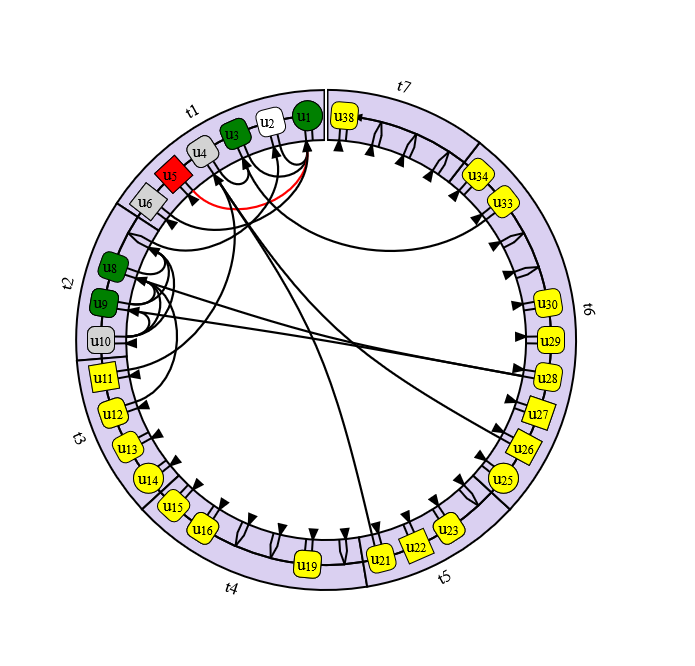

# Cognitive Maps of Knowledge Diagnosis

Cognitive Maps of Knowledge Diagnosis (CMKD) - visualization method for describing hierarchical subjects, semantically connected between each others. It can be used for representing such entities like educational courses with purpose to improve learning experience. More details about method in [this paper](https://link.springer.com/chapter/10.1007/978-3-031-73344-4_51)

## Storybook

[link](https://determaer.github.io/CMKD)

## Screenshot



## Inputs

| Prop  | Input | Destination |
| ------------- | ------------- | ------------- | 
| drawingMode  | 'default', 'score', 'light'  | Defines form of CMKD - excluding not significant lines, applying color on elements, etc |
| width  | Number  | Width and height of the CMKD block  |
| labels  | Label[]  | Array of elements, combined like parametric map, including data from learner model, course model  |
| position  | Number  | Position of the last 'learned' element for simplifying CMKD's connections |
| showSupportRect  | Boolean  | Including additional material, presented outside of basic trajectory of course in CMKD |
| showImportant  | Boolean  | Highlighting important connection lines |

## Events

@clicked - return information about sector, connection line or element label when user events click. 

## Save CMKD to PNG

```vue
<script setup>
const cmkd = ref()
//execute this in some event
cmkd.value.downloadURI()
</script>

<template>
  <CMKD 
    ref="cmkd"
    ...
  />
</template>
```

## Installation

` npm install @determaer/cmkd `

```js
//src/main.js
import VueKonva from 'vue-konva'
//append use(VueKonva) before mount like in example
createApp(App).use(VueKonva).mount('#app')
```

